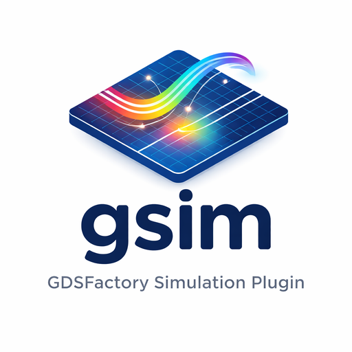

# gsim 0.0.5

> Electromagnetic simulation for photonics and electronics, powered by [GDSFactory+](https://gdsfactory.com)



## Overview

gsim connects GDSFactory layout designs to multiple EM solvers for photonic and electronic simulation. It handles
geometry extraction, mesh generation, port configuration, and cloud execution so you can go from GDS to S-parameters
with minimal boilerplate.

## Solvers

| Module        | Solver                                      | Method | Use Case                                               |
| ------------- | ------------------------------------------- | ------ | ------------------------------------------------------ |
| `gsim.palace` | [Palace](https://awslabs.github.io/palace/) | FEM    | RF/microwave, impedance extraction, driven simulations |
| `gsim.meep`   | [Meep](https://meep.readthedocs.io/)        | FDTD   | Photonic components, S-parameters, mode propagation    |

## Features

- **Layer stack extraction** — build 3D geometry from PDK layer stacks
- **Port configuration** — convert GDSFactory ports into solver-compatible definitions
- **Mesh generation** — GMSH finite-element meshes with configurable quality presets (Palace)
- **Cloud execution** — upload, run, and download results via `gsim.gcloud`
- **Visualization** — solver-agnostic 3D/2D component preview (PyVista, Matplotlib)

## Installation

```bash
pip install gsim
```

For development (requires [uv](https://docs.astral.sh/uv/)):

```bash
git clone https://github.com/gdsfactory/gsim
cd gsim
uv sync --dev
```

Or use the justfile:

```bash
just dev
```

## Documentation

See the [documentation](https://gdsfactory.github.io/gsim/) for API reference and examples.

## License

[Apache-2.0](LICENSE)
